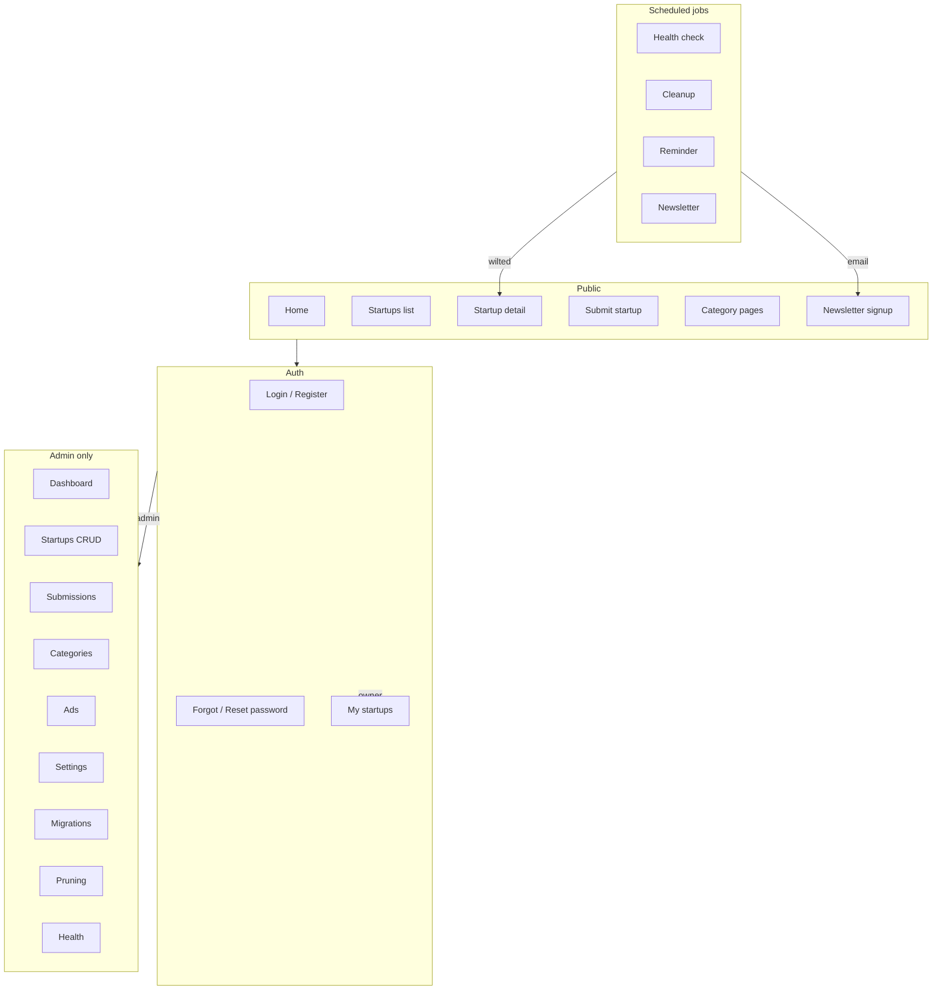
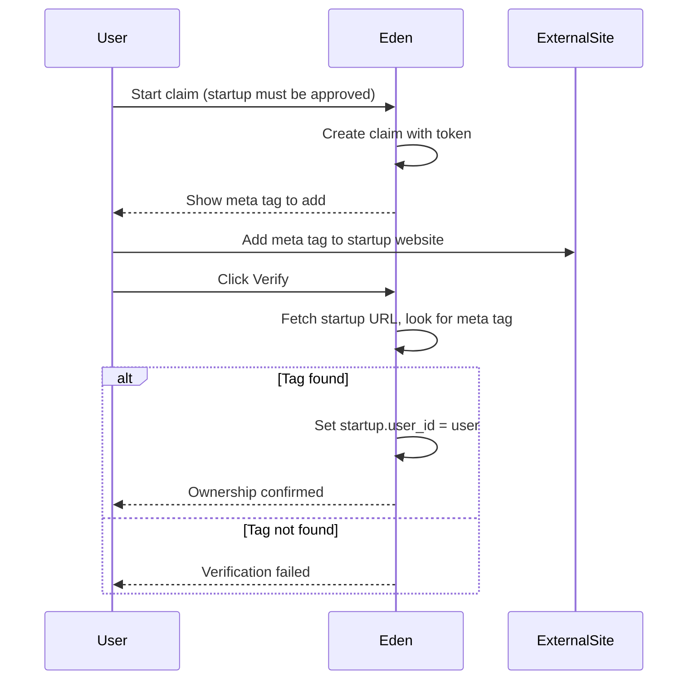
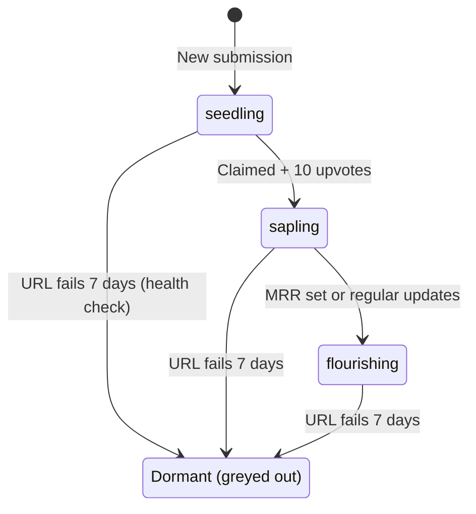
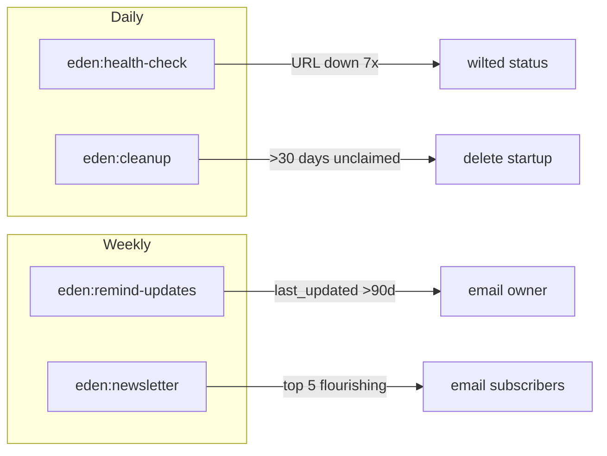
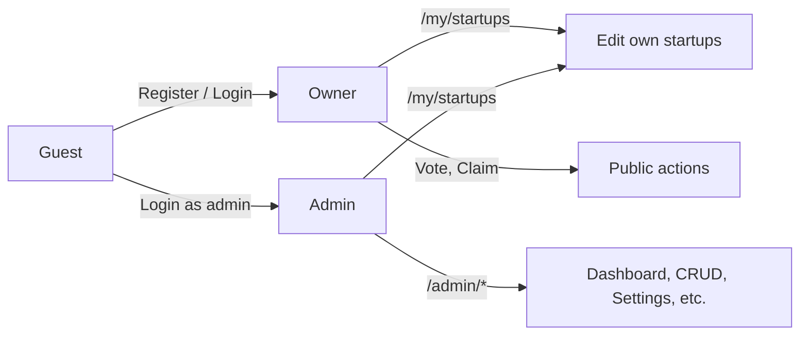

# Eden – Tech Startup Directory

Laravel-based directory for tech startups, SaaS, and online businesses. Theme: "The Startup Garden" — listings grow from seedlings to flourishing trees.

**Stack:** Laravel (PHP 8.2+), MySQL, Blade, vanilla CSS/JS.

**Contents:** [Feature list](#feature-list) · [Process flows](#process-flows) · [Installation](#installation) · [Config & themes](#config--themes) · [Development reference](#development-reference)

---

## Feature list

### Public site

| Feature | Description |
|--------|-------------|
| **Homepage** | Featured startups, categories, newsletter signup. |
| **Startup listing** | `/startups` — search (name/description/tags), filter by category, status (New/Growing/Flourishing/Dormant), for-sale. Paginated. |
| **Startup detail** | `/startups/{slug}` — name, description, category, badges (New, Featured, Verified, status), founder, tags, MRR/ARR, for-sale link, upvote count. View count incremented. |
| **Submit startup** | `/startups/create` — anyone can submit; goes to pending until admin approves. Rate limited (5/hour). |
| **Category pages** | `/category/{slug}` — startups in that category. |
| **Newsletter** | Footer form to subscribe; signed unsubscribe link in each email. Rate limited (5/min). |
| **Blog** | `/blog` — public list of published posts; `/blog/{slug}` — post detail with meta description and JSON-LD (Article). |
| **Sitemap** | `/sitemap.xml` — home, startups list, blog list, all startup, category, and blog post URLs. |
| **Robots** | `/robots.txt` — allow /; disallow /admin, /install, /login, /register; sitemap URL. |
| **Themes** | Admin selects theme in Settings; default **Basic**. CSS per theme in `public/css/themes/{name}.css`. |

### Auth & users

| Feature | Description |
|--------|-------------|
| **Register** | `/register` — name, email, password. Role: owner. Rate limited (5/min). |
| **Login** | `/login` — email, password, remember me. Admin → `/admin`; owner → `/my/startups`. Rate limited (5/min). |
| **Logout** | Session invalidated; CSRF regenerated. |
| **Forgot password** | `/forgot-password` — send reset link by email. Rate limited (3/min). |
| **Reset password** | `/reset-password/{token}` — set new password. Requires mail configured. |
| **My startups** | `/my/startups` — list and edit startups you own (claimed or created). Owners only; no access to `/admin`. |
| **My blog** | `/my/blog` — list, create, edit, delete your posts (if you have blogging access). Blogging can be a paid pro feature. |
| **Pro & payments** | `/pro` — view pro features and prices; checkout via PayPal or PayNow (Zimbabwe). Admin marks each feature as pro or free and sets prices. |
| **Admin area** | `/admin` — only users with admin role. Dashboard, startups, submissions, categories, ads, blog list, gateways, mail, social, settings, migrations, health, pruning. |

### Startup lifecycle & ownership

| Feature | Description |
|--------|-------------|
| **Status** | seedling (new) → sapling (growing) → flourishing; or **wilted** (dormant) when site URL fails health check for 7 days. |
| **Claim** | Logged-in user starts claim at `/startups/{slug}/claim`; gets unique meta tag to add to their site. Only **approved** startups can be claimed. |
| **Verify** | User adds `<meta name="eden-verification" content="TOKEN">` to site; clicks Verify; ownership assigned. |
| **Vote** | Logged-in users can upvote a startup once; count shown; affects growth logic. |
| **Edit (owner)** | Owner edits at `/my/startups/{slug}/edit` (name, slug, description, URL, category, founder, tags, MRR, ARR, for-sale). Status/featured only by admin. |
| **Edit (admin)** | Admin edits any startup at `/admin/startups`; can set status, featured, approve/reject, delete. |

### Admin dashboard

| Feature | Description |
|--------|-------------|
| **Reports snapshot** | Totals (startups, pending, claimed, unclaimed), recent submissions, most viewed, top MRR. |
| **Startups** | List all; search; add startup (admin only); edit, approve, reject, delete. |
| **Submissions** | Pending submissions; approve or reject. |
| **Categories** | CRUD categories (name, slug, icon path). |
| **Ads** | CRUD ad units. Slots: above fold, in-feed, sidebar, in-content. Types: AdSense, ZimAdsense, custom. Global AdSense client in Settings; fallback when unit inactive. |
| **Gateways & Pro** | PayPal client ID/secret; PayNow (Zimbabwe) integration ID/key. Per-feature: mark as pro or free; set price (e.g. for blogging). |
| **Mail** | Choose driver: SMTP or PHP mail. Set host, port, from address, encryption; used for password reset, reminder emails, newsletter. |
| **Social** | LinkedIn, Facebook, Instagram app ID and secret (for future OAuth/enrichment). Founders and startups set their own social profile URLs on startup edit. |
| **Settings** | Site name, App URL, timezone, logo upload, AdSense client ID, **Site theme**. |
| **Migrations** | List pending/modified migrations; run migrations from UI (no SSH). |
| **Pruning** | Filter by URL pattern or empty description; bulk delete startups. |
| **System health** | Last run times for health-check, cleanup, reminder, newsletter; run each manually; cron instructions. |

### Automation (scheduled commands)

| Feature | Description |
|--------|-------------|
| **Health check** | Daily. Ping each startup URL; on failure increment counter; after 7 consecutive failures set status to wilted. |
| **Cleanup** | Daily. Delete unapproved, submitted, unclaimed startups older than 30 days. |
| **Reminder** | Weekly. Email owners whose startup was last updated &gt;90 days ago (or never); link to edit. |
| **Newsletter** | Weekly (Monday 08:00). Top 5 flourishing startups by MRR; plain-text email to subscribers; unsubscribe link in body. |

### Security & limits

| Feature | Description |
|--------|-------------|
| **Rate limits** | Login/register 5/min; startup submit 5/hour; newsletter 5/min; forgot password 3/min; pro checkout 5/min; install POST 3/min. |
| **CSRF** | All forms; session regeneration on login/logout. |
| **Access** | Admin middleware on `/admin`; owner edits only own startups via `/my/startups`. |

### SEO & styling

| Feature | Description |
|--------|-------------|
| **SEO** | Canonical URL and meta description on startup pages; JSON-LD (Organization); prompt if description &lt;300 words. |
| **Styling** | Public: theme CSS. Admin: GA-style layout and `admin.css`. No inline styles. |

---

## Process flows

### App overview



### Submission and approval

```mermaid
sequenceDiagram
    participant Visitor
    participant Site
    participant Admin
    Visitor->>Site: Submit startup (name, description, URL, etc.)
    Site->>Site: Create startup (pending, seedling)
    Site-->>Visitor: "Subscribed" / success
    Admin->>Site: Open Submissions
    Site-->>Admin: List pending
    alt Approve
        Admin->>Site: Approve
        Site->>Site: Set approved_at
        Startup appears on public listing
    else Reject
        Admin->>Site: Reject
        Site->>Site: Clear approved_at
        Startup stays unlisted
    end
```

### Claim and verify ownership



### Startup status lifecycle



### Scheduled commands



### User roles and access



---

## Planned (not implemented)

- Tailwind CSS; Spatie Media Library / WebP.
- Comments/reviews; DNS or file verification; auto-approval; paid featured listings; premium analytics; verified investors; multiple admins per startup; advanced animations.

**Already implemented:** Alpine.js (CDN), Redis (optional cache/sessions), sponsored labels, OAuth (Login with Google), public API (read-only startups), social sharing buttons (X, LinkedIn, WhatsApp).

---

## Installation

### Requirements

- PHP 8.2+
- Composer
- MySQL 5.7+ or MariaDB
- Web server (Apache or Nginx) with document root set to `public/`

### Local (XAMPP / Laragon)

1. Clone or upload the project.
2. Copy `.env.example` to `.env` (or use the web installer to create it).
3. Run: `composer install --no-dev` (or `composer install` for development).
4. Run: `php artisan key:generate` (if not using the web installer).
5. Create a MySQL database and set `DB_*` in `.env`.
6. Either:
   - **Web installer:** Open `http://your-local-url/install` in the browser and complete the form (database, site name, admin account, optional logo URL). The installer runs migrations and disables itself.
   - **CLI:** Run `php artisan migrate --force`, then create an admin user manually or via a seeder.
7. Ensure `storage/` and `bootstrap/cache/` are writable.
8. Point the document root to the `public/` directory.

### Live server / VPS

1. Upload the project (e.g. via Git or FTP).
2. Set the web server document root to `public/`.
3. If you have SSH: run `composer install --no-dev` and `php artisan key:generate`. Otherwise use the **web installer** at `https://your-domain.com/install` and fill in database, site name, logo, and admin account. The installer runs migrations and sets `EDEN_INSTALLED=true`.
4. Make `storage/` and `bootstrap/cache/` writable:  
   `chmod -R 775 storage bootstrap/cache`

### Shared hosting (FTP only)

1. Upload all files. Set the domain’s document root to the `public` folder (e.g. “Document root” pointing to `eden/public` or equivalent).
2. Ensure `storage/` and `bootstrap/cache/` are writable (e.g. chmod 775 via file manager).
3. Open `https://your-domain.com/install` and complete the installer (database, site name, admin). It writes `.env` and runs migrations. No SSH required.

### Deploy via cPanel Git

Eden includes a [.cpanel.yml](.cpanel.yml) for [cPanel Git™ deployment](https://docs.cpanel.net/knowledge-base/web-services/guide-to-git-deployment/). Push or pull deployment will copy the app into a directory you choose; cPanel runs the tasks in `.cpanel.yml` on deploy.

**Requirements (cPanel):**

- A valid `.cpanel.yml` in the repo root (checked in).
- One or more local or remote branches.
- A clean working tree.

**One-time setup on cPanel:**

1. In **cPanel → Files → Git™ Version Control**, create or clone the repository.
2. Edit the repo’s `.cpanel.yml` and set `DEPLOYPATH` to your app directory (e.g. `/home/your_cpanel_user/eden/`). Do **not** use a wildcard to deploy all files.
3. Set the domain’s **document root** to `$DEPLOYPATH/public` (Laravel’s public folder).
4. First deploy only: on the server run `composer install --no-dev`, create `.env` from `.env.example`, run `php artisan key:generate`, run migrations, and ensure `storage/` and `bootstrap/cache/` are writable (e.g. chmod 775). Or use the web installer at `https://your-domain.com/install` after the first deploy.

**Deployment modes:**

- **Automatic (push):** Push directly to the cPanel-managed repo; the post-receive hook runs `.cpanel.yml` and deploys to `DEPLOYPATH`.
- **Manual (pull):** Push to GitHub/GitLab etc., then in cPanel use **Update from Remote** and **Deploy HEAD Commit** to deploy.

### After install

- **Admin:** Log in at `/login` with the admin account, then go to `/admin` (or use “Admin” in the main nav when logged in as admin).
- **Migrations:** In Admin → Migrations you can see pending migrations and run them with one click.
- **Cron (optional):** For health check, cleanup, reminder emails, and newsletter, add a cron job:  
  `* * * * * php /path/to/your/project/artisan schedule:run`

### Mail configuration (password reset, reminder, newsletter)

Password reset, "remind owners to update" emails, and the weekly newsletter use Laravel’s mail system. Set in `.env`:

- **MAIL_MAILER** – e.g. `smtp`, `sendmail`, or `log` (for local testing).
- **MAIL_HOST**, **MAIL_PORT**, **MAIL_USERNAME**, **MAIL_PASSWORD**, **MAIL_ENCRYPTION** – for SMTP.
- **MAIL_FROM_ADDRESS** and **MAIL_FROM_NAME** – sender for all outgoing mail.

If mail is not configured, password reset links will not be sent and reminder/newsletter commands may fail (failures are logged). See [Laravel Mail](https://laravel.com/docs/mail) for details.

### Optional: Redis (cache / sessions)

By default Eden uses `file` for cache and sessions. For better performance on busy sites you can use Redis:

1. Install Redis on the server.
2. In `.env` set: `CACHE_STORE=redis`, `SESSION_DRIVER=redis` (optional), and Redis connection vars: `REDIS_HOST=127.0.0.1`, `REDIS_PASSWORD=null`, `REDIS_PORT=6379`.
3. Laravel’s `config/cache.php` and `config/database.php` already define the `redis` driver; no code changes needed.

### Troubleshooting

- **500 error:** Check that `storage/` and `bootstrap/cache/` are writable and that `APP_KEY` is set in `.env`.
- **Install page not loading:** Ensure `EDEN_INSTALLED` is not set to `true` in `.env` before you’ve finished installing.
- **Database connection error:** Verify `DB_HOST`, `DB_DATABASE`, `DB_USERNAME`, and `DB_PASSWORD` in `.env`.

---

## Config & themes

- **Themes:** Configured in `config/themes.php`. Default theme is `basic`; CSS lives in `public/css/themes/basic.css`. To add a theme, add an entry in `config/themes.php` and create `public/css/themes/{key}.css`.
- **Site settings:** Admin → Settings (site name, URL, timezone, logo, AdSense client ID, theme). No need to edit `.env` for these.

---

## Development reference

- **Database:** Users, Startups, Categories, Claims, Votes, Ads, Settings, NewsletterSubscriber, GrowthLog, BlogPost, FeaturePayment (and migrations). Status lifecycle: seedling → sapling → flourishing; wilted when URL is down.
- **Key routes:** `/`, `/startups`, `/startups/create`, `/startups/{slug}`, `/category/{slug}`, `/blog`, `/blog/{slug}`, `/claim/{slug}`, `/pro`, `/pro/checkout`, `/payment/return/{payment}`, `/login`, `/register`, `/forgot-password`, `/reset-password/{token}`, `/my/startups`, `/my/blog` (owner), `/admin` (admin only), `/admin/gateways`, `/admin/mail`, `/admin/social`, `/sitemap.xml`, `/robots.txt`, `/install` (until installed).
